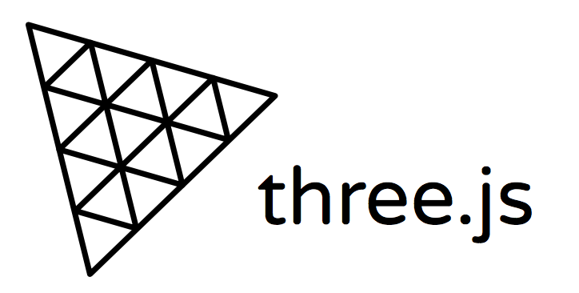

<h1 align="center">
    
</h1>

Exemplo da biblioteca Three.js 

Funcionamento de Three.js
    
 Programa em HTML que utiliza a biblioteca Three.js para renderizar um grafico em 3D interativo.

📌 Exemplo do funcionamento da biblioteca Three.js
------------------

## Sintaxe para executar:

<pre>docker compose up -d </pre>

O projeto foi feito em Html.

The project was done with Html.

🔧 Tecnologias utilizadas:
------------------

- html
- Javascript (biblioteca three.js)

💬 Fale comigo
------------------
[*Entre em contato comigo*](https://www.linkedin.com/in/ivo-baptista-3712144/)

